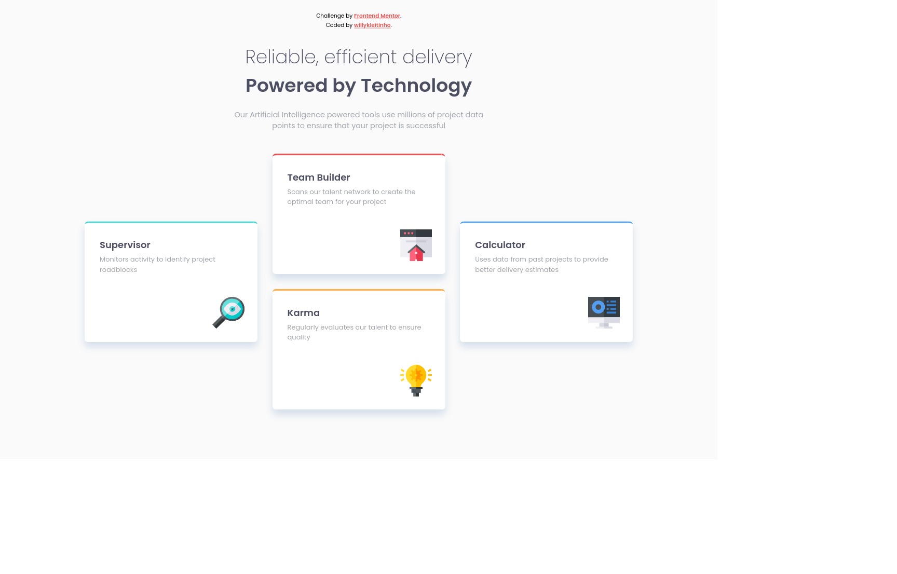

# Frontend Mentor - Four card feature section solution

This is a solution to the [Four card feature section challenge on Frontend Mentor](https://www.frontendmentor.io/challenges/four-card-feature-section-weK1eFYK). Frontend Mentor challenges help you improve your coding skills by building realistic projects. 

## Table of contents

- [Overview](#overview)
  - [The challenge](#the-challenge)
  - [Screenshot](#screenshot)
  - [Links](#links)
- [My process](#my-process)
  - [Built with](#built-with)
  - [What I learned](#what-i-learned)
  - [Useful resources](#useful-resources)
- [Author](#author)

## Overview

### The challenge

Users should be able to:

- View the optimal layout for the site depending on their device's screen size

### Screenshot

### Links

- Solution URL: [on Frontend Mentor](https://www.frontendmentor.io/solutions/four-card-feature-section-using-flexbox-and-custom-properties-9pd-Ox2Jr)
- Live Site URL: [on Github Pages](https://willykleitinho.github.io/four-card-feature-section/)

## My process

### Built with

- Semantic HTML5 markup
- CSS custom properties
- Flexbox
- Mobile-first workflow

### What I learned

In this project I practiced writing clean CSS and HTML, mobile-first workflow, Flexbox and planning the layout before writing anything.

### Useful resources

- [Kevin Powell's YouTube Channel](https://www.youtube.com/channel/UCJZv4d5rbIKd4QHMPkcABCw) - Kevin's content on CSS is really good and helps clarify and understand a lot of hard concepts of CSS.

## Author

- Github - [willykleitinho](https://github.com/willykleitinho)
- Frontend Mentor - [@yourusername](https://www.frontendmentor.io/profile/willykleitinho)
